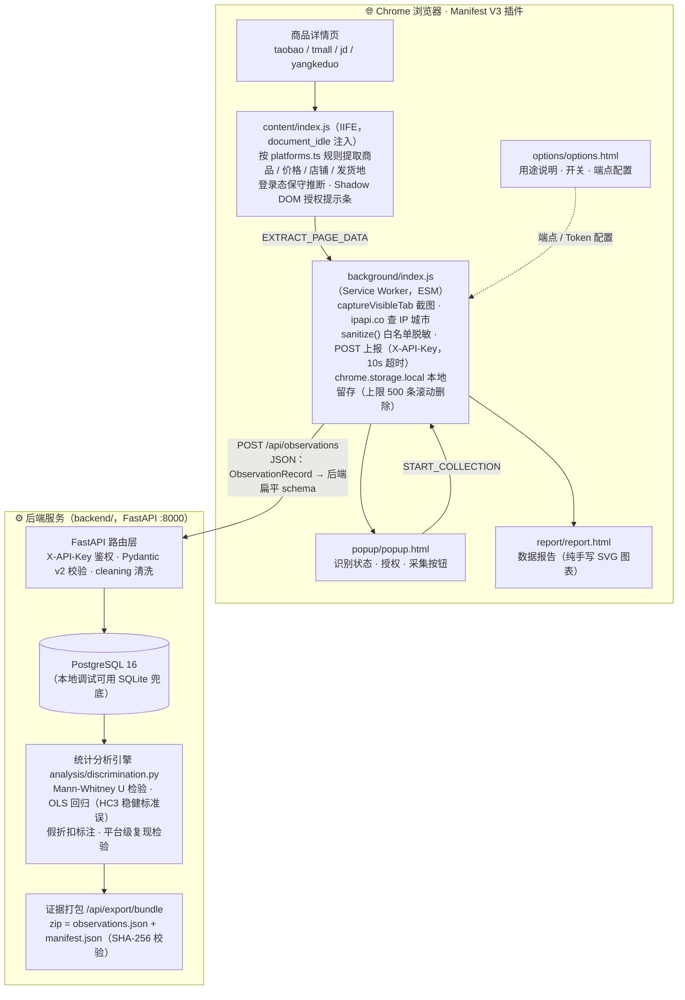

<div align="center">

# 🔍 算法歧视众包观测 · 数据采集插件

**公益诉讼用途的算法定价歧视众包数据采集 Chrome 扩展（Manifest V3）**

[](LICENSE)
[](public/manifest.json)
[](tsconfig.json)
[](backend/requirements.txt)
[](backend/Dockerfile)
[](public/manifest.json)

支持平台：淘宝 · 天猫 · 京东 · 拼多多（网页版）

</div>

---

## 📖 项目简介

公益诉讼用途的众包数据采集中的一环（浏览器端）。用户在受支持电商平台（淘宝 / 天猫 / 京东 / 拼多多网页版）浏览商品详情页时，经本人授权后一键采集**页面公开展示**的商品、价格、优惠、发货地信息，以及脱敏后的登录/会员状态、设备与网络环境概况，上报至后端 API 并留存本地，供后续的统计检验（如 Mann-Whitney U 检验）与法律评估使用。

本仓库为**全栈单体仓库**：浏览器端插件（Chrome/Edge 扩展，Manifest V3）位于根目录，`backend/` 为独立子项目（FastAPI + SQLite/PostgreSQL + 统计分析引擎，详见 [backend/README.md](backend/README.md)）。法律评估模块为后续规划。

## 📑 目录

- [📖 项目简介](#-项目简介)
- [✨ 功能特性一览](#-功能特性一览)
- [🏗️ 系统架构](#-系统架构)
- [📁 项目结构](#-项目结构)
- [🚀 快速开始](#-快速开始)
- [🔧 构建与测试](#-构建与测试)
- [🔌 后端对接（本地 FastAPI）](#-后端对接)
- [🧪 端到端联调（页面探针）](#-端到端联调页面探针)
- [📦 功能详述（按版本）](#-功能详述按版本)
- [📊 模拟页回归验证](#-模拟页回归验证)
- [🔒 隐私说明](#-隐私说明)
- [⚠️ 已知限制](#-已知限制)
- [📄 License](#-license)

## ✨ 功能特性一览

| 能力 | 说明 |
| --- | --- |
| 🛒 多平台支持 | 淘宝 / 天猫 / 京东 / 拼多多网页版商品详情页，平台选择器规则集中于 `platforms.ts`，扩展新平台只改一处 |
| 🔐 授权优先 | 未授权时注入 Shadow DOM 提示条（同意并采集 / 仅本次采集 / 忽略）；consent=false 时自动采集禁用 |
| 💰 双通道价格提取 | DOM 选择器优先 + 内嵌 JSON 回退（g_config / __INIT_DATA / pageData），每字段带来源标注 |
| 🤖 自动采集 | 商品页自动触发，SPA 路由兼容，10 分钟内同商品去重 |
| 🔁 失败重试 | 上报失败本地暂存，手动重试，错误信息翻译为可执行提示 |
| 🧩 页面探针 | 自包含 JS 探针，经 CDP 在真实页面端到端验证「提取 → 映射 → 上报」链路 |
| 📊 本地数据报告 | 纯手写 SVG 图表，零图表库依赖 |
| 🧼 白名单脱敏 | `sanitize()` 逐字段显式拷贝，昵称/推断依据绝不上传 |

### 🗓️ 版本演进

| 版本 | 主题 |
| --- | --- |
| v0.2.0 | 自动采集 |
| v0.2.1 | 失败重试与错误提示 |
| v0.3.0 | 增强抓取（多策略提取框架） |
| v0.3.2 | 真实页面结构修复（2025 版详情页实测诊断） |
| v0.3.4 / v0.3.5 | 价格抓取收紧（状态A/状态B 双渲染态适配、等待逻辑修正） |
| **v0.3.6** | **当前版本** |

各版本详细说明见 [📦 功能详述（按版本）](#-功能详述按版本)。

## 🏗️ 系统架构



<details>
<summary>📜 文字版架构图（原始版本，点击展开）</summary>

```text
┌──────────────────────────── Chrome 浏览器 ────────────────────────────┐
│                                                                       │
│  商品详情页（taobao/tmall/jd/yangkeduo）                               │
│   └─ content/index.js（IIFE，document_idle 注入）                      │
│       · 按 platforms.ts 规则提取商品/价格/店铺/发货地                   │
│       · 登录态保守推断（cookie 只判断键名存在性，绝不读取值）           │
│       · 未授权时注入 Shadow DOM 提示条（同意并采集/仅本次采集/忽略）    │
│       · 响应 EXTRACT_PAGE_DATA 消息                                    │
│              ▲ chrome.runtime.onMessage                               │
│              ▼                                                        │
│  background/index.js（service worker，ES module）                      │
│       · START_COLLECTION 消息路由：校验授权 → 要页面数据               │
│       · chrome.tabs.captureVisibleTab 截图（失败降级 screenshotError） │
│       · fetch ipapi.co/json/ 查 IP 城市（5s 超时，失败降级 null）      │
│       · sanitize() 白名单脱敏（店铺名/昵称可选「张*」打码）            │
│       · POST 上报（X-Observation-Token 头，10s 超时）                  │
│       · 无论成败都写 chrome.storage.local（上限 500 条滚动删除）       │
│              ▲                        ▲                ▲              │
│              ▼                        ▼                ▼              │
│  popup/popup.html            options/options.html   report/report.html│
│  识别状态/授权/采集按钮       用途说明/开关/端点配置   纯手写 SVG 图表  │
└───────────────────────────────────────────────────────────────────────┘
                     │ POST（JSON，ObservationRecord）
                     ▼
              后端 API（options 页可配置端点与 token）
```

</details>

## 📁 项目结构

```text
.
├── manifest.json                 # 位于 public/，构建时原样拷贝到 dist/
├── vite.config.ts                # 主构建：background + popup/options/report（ESM）
├── vite.content.config.ts        # content script 独立构建（IIFE，MV3 硬性要求）
├── tsconfig.json                 # strict 类型检查（tsc --noEmit 纳入 build）
├── package.json
├── public/
│   ├── manifest.json             # MV3 清单
│   └── icons/                    # 16/48/128 占位图标（scripts/gen-icons.py 生成）
├── scripts/
│   ├── gen-icons.py              # 图标生成脚本（Python PIL）
│   ├── verify-dist.mjs           # dist 产物核验（npm run verify）
│   └── gen-page-probe.mjs        # 页面探针打包（npm run build:probe，esbuild 编译为自包含 JS）
├── src/
│   ├── types.ts                  # ObservationRecord / BackendObservationPayload 等全模块共用类型与常量
│   ├── platforms.ts              # 平台选择器规则（可配置化，扩展新平台只改这里）
│   ├── utils.ts                  # errMsg / escapeHtml / maskText 小工具
│   ├── shared/
│   │   ├── extract.ts            # 页面数据提取纯函数（content script 与页面探针复用，不依赖 chrome API）
│   │   └── backendMapping.ts     # ObservationRecord → 后端扁平 schema 字段映射（纯函数，可 Node 单测）
│   ├── content/index.ts          # 内容脚本：提示条 + 消息响应（提取逻辑在 shared/extract.ts）
│   ├── background/index.ts       # service worker：截图、IP 城市、映射上报、消息路由
│   ├── popup/popup.html|.ts      # 弹窗：授权说明、采集按钮、最近采集状态（含后端 observationId 与清洗提示数）
│   ├── options/options.html|.ts  # 设置页：用途说明、同意开关、API 端点与 API Key、脱敏开关、历史管理
│   ├── report/report.html|.ts    # 数据报告页：纯手写 SVG 图表（无图表库）
│   └── probe/page-probe.ts       # 页面探针入口（打包为 dist-test/page-probe.js）
├── test/
│   ├── run-mapping-test.mjs      # backendMapping 单元测试（esbuild 临时编译 + Node 断言，npm test）
│   └── run-extract-test.mjs      # 页面提取回归测试（jsdom 加载 e2e/ 模拟页 + 逐字段断言，npm run test:extract）
├── e2e/
│   ├── mock-tmall-a.html         # 【模拟页】天猫商品 982252700443：数据仅在内嵌 JSON（纯 JSON 通道）
│   ├── mock-tmall-b.html         # 【模拟页】天猫商品 651981565426：DOM+JSON 混合（原价走 JSON 回退）
│   └── mock-taobao-c.html        # 【模拟页】淘宝商品 836035130704：经典 DOM 节点（纯 DOM 通道）
├── dist/                         # 构建产物（在 chrome://extensions 加载此目录）
└── dist-test/                    # 页面探针产物（端到端联调用，不参与扩展加载）
```

> 💡 后端服务（`backend/`）为独立子项目，接口与部署文档见 [backend/README.md](backend/README.md)。

## 🚀 快速开始

### 1️⃣ 安装依赖并构建

```bash
npm install
npm run build        # = tsc --noEmit && vite build && vite build --config vite.content.config.ts && 生成页面探针
```

### 2️⃣（可选）核验与测试

```bash
npm run verify       # 核验 dist 产物完整性与 content 脚本 IIFE 形态
npm test             # 串跑 backendMapping 单测（19 项）+ 页面提取回归（21 项）
```

### 3️⃣ 加载到 Chrome

1. 打开 `chrome://extensions`，右上角开启「开发者模式」。
2. 点击「加载已解压的扩展程序」，选择本项目的 `dist/` 目录。
3. 打开淘宝/天猫/京东/拼多多网页版的任一商品详情页：
   - 未授权时页面顶部会出现提示条，可选择【同意并采集】【仅本次采集】【忽略】；
   - 或点击工具栏插件图标，在弹窗中先【同意并参与】，再点【采集本页数据】。
4. 在弹窗中可跳转「数据报告」页与「设置」页；设置页可配置上报 API 端点与 API Key、脱敏开关、清空历史。

### 4️⃣ 启动本地后端（接收上报数据）

```bash
cd backend
docker compose up -d --build     # 一键起 PostgreSQL + API（:8000）
```

> 💡 Windows 用户也可直接双击项目根目录的 `启动本地服务.bat` 一键启动。完整说明见 [backend/README.md](backend/README.md)。

## 🔧 构建与测试

```bash
npm install
npm run build        # = tsc --noEmit && vite build && vite build --config vite.content.config.ts && 生成页面探针
npm run verify       # 可选：核验 dist 产物完整性与 content 脚本 IIFE 形态
npm test             # 可选：串跑 backendMapping 单测（19 项）+ 页面提取回归（21 项）
npm run test:extract # 可选：单独跑页面提取回归（jsdom + e2e/ 三个模拟页）
npm run build:probe  # 可选：单独生成页面探针 dist-test/page-probe.js
```

构建为两段式：主构建产出 ESM 的 service worker 与三个页面；content script 由独立配置以 lib/IIFE 模式产出（Chrome MV3 的 content_scripts 不接受 ES module）。

## 🔌 后端对接（本地 FastAPI）

<a id="-后端对接"></a>

- 默认端点 `http://127.0.0.1:8000/api/observations`，鉴权头 `X-API-Key`（默认 `dev-key-123`），均可在设置页修改。
- manifest 的 `host_permissions` 已包含 `http://127.0.0.1/*` 与 `http://localhost/*`（本地后端联调用；manifest 为严格 JSON 不支持注释，特此说明）。改用其他域名时需加入 `host_permissions` 重新构建，或由后端 CORS 放行。
- 上报载荷由 `src/shared/backendMapping.ts` 的 `mapObservationToBackend()` 生成，完整映射表见该文件头部注释。要点：

  | 要点 | 说明 |
  | --- | --- |
  | 平台 id 映射 | `yangkeduo` → 后端 `platform_code = pinduoduo`，taobao / tmall / jd 直通 |
  | 价格单位 | 价格字段（`display_price_cents` / `actual_pay_price_cents` / `discount_coupon_amount_cents`）由**插件侧换算为整数分**后上报（`Math.round(元 × 100)`，null 保持 null）——避免 JSON 把整数元值（如 5999.0 → `5999`）序列化后在 Python 侧被解析为 int、被误认为「已是分」而造成 100 倍错误 |
  | 卖家标识 | `shopName` → `seller_id`（无独立卖家 ID 时以店铺名代替） |
  | 高峰时段 | `peak_hour` 由采集时刻**本地小时**粗算：11-13 或 19-23 点为 true |
  | 快照处理 | `dom_price_text` 取价格相关第一条快照的纯文本（去标签 ≤500 字符），整份快照与截图**不上传**（体积原因，后续走文件上传接口） |
  | 隐私红线 | **昵称（userMarker/userMarkerMasked）与推断依据（evidence）绝不上传** |

- 后端返回 `{"observation_id","created_at","warnings"}`：observationId 写入本地记录，warnings 存入记录并在弹窗显示「已上报（N 条清洗提示）」。

## 🧪 端到端联调（页面探针）

`dist-test/page-probe.js` 是自包含无 import/export 的纯 JS 文件（与 content script 复用同一份提取与映射逻辑）。在真实浏览器商品详情页通过 CDP `Runtime.evaluate(探针源码, { awaitPromise: true })` 或控制台执行，返回 JSON 字符串：`{ok, status, observationId, warnings, extracted:{...}}`，用于验证「提取 → 映射 → POST 到 127.0.0.1:8000」的完整链路。

## 📦 功能详述（按版本）

<a id="-功能详述按版本"></a>

### 🤖 自动采集（v0.2.0 新增）

- **开关位置**：弹窗「授权状态」卡内的「商品页自动采集」开关，与设置页「授权」区同名开关实时同步（chrome.storage.onChanged）；未授权（consent=false）时禁用并提示先同意授权。
- **触发时机**：开关与授权都打开后，在受支持平台的列表页/首页点击商品链接进入商品详情页，只要能提取到 productId 即自动采集上报，无需点工具栏按钮；成功后页面右上角弹出 3 秒自动消失的 toast「✅ 已自动采集本页观测数据」，失败静默不打扰。
- **SPA 兼容**：content script 包装 `history.pushState/replaceState` + 监听 `popstate` + 1.5s URL 轮询兜底；URL 变化后延迟 2 秒等 DOM 稳定再重新检测。
- **去重规则**：content 侧内存 Set 保证同一次页面会话内同一 productId 只触发一次；background 侧 `lastAutoCollect`（`{productId: timestamp}`）保证同一商品 10 分钟内不重复自动采集（手动采集不受限，去重表最多保留最近 200 个商品）。
- **截图降级**：自动触发无用户手势，`captureVisibleTab` 大概率因权限不足失败，走 `screenshotError` 降级，其余字段不受影响。
- **隐私前提**：自动采集仅在 consent=true 且开关打开时发生（content 与 background 双重校验），上报内容与手动采集一致（同样经白名单脱敏）。

### 🔁 失败重试与错误提示（v0.2.1 新增）

- **本地暂存**：上报失败（网络不通、超时、HTTP 4xx/5xx）时记录不丢失——先以 `uploadStatus: 'failed'` 存进 `chrome.storage.local` 的 `observations`，并在 `uploadError` 字段保存具体错误；`CollectionResult` 同步携带 `uploadError` 供 popup 展示。
- **手动重试（不自动静默重试）**：popup 打开时统计 `uploadStatus !== 'success'` 的记录数 N，N>0 显示「重试上报」卡片；点击后向 background 发 `MSG.RETRY_FAILED`，`handleRetryFailed` 逐条用已存数据重新 `mapObservationToBackend` + `uploadObservation`（不重新截图/提取），成功则更新 `uploadStatus`/`observationId` 并清除 `uploadError`，失败则刷新 `uploadError`，最终返回 `RetryResult {retried, succeeded, failed}`，popup 显示「重试 N 条：成功 X 失败 Y」。
- **错误翻译**：`translateUploadError` 把底层异常转成可执行提示——`TypeError`/`Failed to fetch` →「无法连接 `<origin>`（后端未启动或网络不通），请先双击 启动本地服务.bat 启动后端」；`AbortError`/超时 → 超时提示；HTTP 非 2xx 时尝试解析 FastAPI 422 响应体的 `detail` 并以「HTTP `<code>`：`<detail>`」透传。
- **popup 展示**：`renderLast` 在上报失败时追加红色「上报错误：…」行；采集按钮处理器对 `failed` 状态显示橙色「⚠ 已存本地，待重试」；`observations` 的 storage 变化会实时刷新重试计数。

### 💪 增强抓取（v0.3.0 新增）

- **多策略提取框架**：每个字段先走 platforms.ts 的 DOM 选择器列表，失败再走「内嵌 JSON 回退」——收集全部内联 script 文本（上限 2MB），按平台惯例键名优先级正则提取，数值做合法性校验（0.01 ~ 10,000,000 元），取第一个合法值。真实淘宝/天猫 2025 版详情页为 React SSR + CSS Modules，数据同时存在于 DOM（Price--/priceText/tb-rmb-num 等类名）与初始化 JSON（g_config / __INIT_DATA / pageData），双通道显著提高命中率。
- **键名优先级**：售价 `priceText/promotePrice/currentPrice/salePrice/price`；原价 `origPrice/originalPrice/reservePrice/marketPrice/strPrice`（origPrice/originalPrice 为淘宝天猫惯例，reservePrice 为部分版本一口价原价兜底）；到手价 `finalPrice/couponPrice/promotePrice/handPrice`；发货地 `deliveryAddress/areaName/sendAddress/shipFrom/deliveryCity`；店铺名 `shopName/shopNick/mallName/sellerNick`；店铺 ID `shopId/shop_id/sellerId/seller_id`。
- **到手价语义修正**：`price.final` 仅在 DOM/JSON 显式存在券后价时填充，取不到保持 null（**不再回退为售价**）——分析侧需要明确区分原价与折扣价。
- **发货地归一化**：`shipping.shipFromCity` 保留原文（如「配送至 北京市 朝阳区」），新增 `shipFromCityNormalized` 提取市级关键词（直辖市直返；省名命中后取其后 1-4 汉字市名）。后端 `shipping_city` 优先填归一化值，为空回退原文。
- **店铺 ID（新增 `shopId` 字段）**：`data-shopid`/`data-sellerid` 属性 → 店铺链接 href 的 `shopId/shop_id/sellerId` 参数 → 内嵌 JSON 同名键。后端 `seller_id` 优先填 shopId，为空回退店铺名（后端 schema 不变）。
- **来源标注**：新增 `extractionMeta`（每字段 `'dom' | 'json' | null`），随记录入库并追加为一条 `field: 'extractionMeta'` 的 domSnapshot，便于排查某条数据来自哪个通道。

### 🛠️ 真实页面结构修复（v0.3.2，2025 版详情页实测诊断）

- **价格双价归属语义**：新版页面到手价在 `[class*="highlightPrice--"]`（「平台加补后￥3188.55」），原价在 `[class*="subPrice--"]`（「优惠前￥3799」，**无优惠时该节点不存在**）。规则：subPrice 命中 → subPrice=原价、highlightPrice=到手价；subPrice 未命中 → highlightPrice=原价（售价）、到手价=null。`[class*="Price--"]` 大容器会拼接两个价格文本，严禁用它抓原价。
- **店铺名**：首选 `span[class*="shopName--"]`（带 title 属性，文本干净）；回退选择器命中外层 wrapper 混入评分文字（「明智电脑科技4.690天新增…」）时，`cleanShopName` 截断取第一个连续非数字段（数字开头的店名如「360官方旗舰店」不处理）。
- **店铺 ID**：真实页内联 script 均有 `"shopId"`/`"sellerId"`，JSON 回退通道已覆盖；DOM 侧 data-shopid → 店铺链接 href 参数优先。
- **发货地**：首选 `[class*="deliveryAddrWrap--"]`（「浙江嘉兴 至 北京市 海淀区」），归一化先按「至」切分取**发货侧**（左侧纯「配送/发货/快递」前缀时取右侧），再做省市关键词提取。
- **优惠信息**：coupon 首选 `[class*="couponInfoArea--"]`（「已享受:官方立减38元…」），`parseCoupon` 的 `减\s*(\d+)` 可提取「立减38」金额。
- **无价格不上报**：映射后 `display_price_cents` 为 null → 跳过上报，记录标 `uploadStatus: 'skipped_no_price'`，popup 展示「未抓取到价格，已取消上报。页面可能未加载完成或选择器失效，请刷新重试」；该状态不参与「重试上报」（价格缺失需回页面重新采集）。到手价 null 不阻断。
- **三个 mock 页已改为真实类名结构**（highlightPrice--/subPrice--/span.shopName--/deliveryAddrWrap--/couponInfoArea--），期望值不变，21 项断言全过。

### 🎯 价格抓取收紧（v0.3.4，状态A/状态B 双渲染态适配）

- **价格选择器收紧（仅淘系）**：价格只允许来自明确容器——`[class*="highlightPrice--"]` / `[class*="subPrice--"]` / 经典具体节点（.tb-rmb-num/.tm-price 等）；宽松选择器 `[class*="Price--"]`、`span[class*="priceText"]` 已移除（真实页实测抓到无关数字「48」的根源）。京东/拼多多已验证选择器不动。
- **状态A 简化渲染兜底**：PurchasePanel 主区域内 `div[class*="block2--"]` 的 `span[class*="unit--"]`（￥）+ `span[class*="text--"]`（数字）组合 → 单价格时 display=该价、final=null；**吸顶栏 `[class*="ItemHeadFixed--"]` 内的同名结构一律排除**（里面是重复/缓存价）。
- **大小关系兜底**：original 与 final 都存在且 final > original 时交换两者（大的=原价，小的=到手价）。
- **等待价格模块渲染**：content script 提取不到任何价格时每 500ms 重试，最多约 8 秒（16 次），等待状态A→状态B 异步注水；超时仍无价格才记 null（沿用「价格为 null 不上报」，popup 提示页面未加载完整）。
- **补贴文案识别**：「已享受: ¥500百亿补贴」「领政府补贴省562.69」等提取为 couponAmount/couponType（新增类型「百亿补贴」「平台补贴」），提不到不报错。
- **归一化修复**：省市提取终止符去掉「州」——广州/杭州/苏州等市名以州结尾，旧正则会把「广州」截成「广」。
- 新增 e2e/mock-tmall-d.html（状态A + ItemHeadFixed 干扰价 48 元），断言取主区域 1029、final=null、补贴 500 元/百亿补贴；提取回归共 29 项断言。
- **v0.3.5 等待逻辑修正**：自动/手动采集共用提取链路，差异在时机——自动采集进入页面即触发，常遇状态A。`extractWithPriceWait` 对淘系改为「等完整价格模块」：`highlightPrice--`/`subPrice--` 容器未出现就继续等（20×500ms≈10 秒），即使 block2/JSON 已给出过渡态价格也不提前返回；容器出现（状态B）立即返回；超时才接受状态A/JSON 结果。其他平台维持任一价格非 null 即返回（约 8 秒）。首次自动采集在 `document.readyState !== 'complete'` 时先等 window load（3 秒兜底）再发 AUTO_COLLECT。修复实证：自动采集 48 元/null vs 同页手动 1029/528.84。

## 📊 模拟页回归验证

<a id="-模拟页回归验证"></a>

`test/run-extract-test.mjs`：jsdom 执行真实编译产物。

| 模拟页 | 结构覆盖 | 原价 | 到手价 | 发货地（原文→归一化） | 店铺名 | 店铺ID |
| --- | --- | --- | --- | --- | --- | --- |
| e2e/mock-tmall-a.html（天猫 982252700443） | 双价结构（subPrice+highlightPrice 并存） | 3799 ✅ | 3188.55 ✅ | 浙江嘉兴 至 北京市 海淀区 → 嘉兴 ✅ | 天猫国际自营全球超级店 ✅ | 2212833764123（JSON）✅ |
| e2e/mock-tmall-b.html（天猫 651981565426） | 双价结构 + data-shopid | 18.7 ✅ | 15.74 ✅ | 重庆 至 北京市 海淀区 → 重庆 ✅ | 厮磨工坊旗舰店 ✅ | 889977665（data-shopid）✅ |
| e2e/mock-taobao-c.html（淘宝 836035130704） | 单价结构（无 subPrice）+ 店铺名评分后缀清理 | 3850 ✅ | null（无优惠不回退售价）✅ | 广东深圳 至 北京 海淀 → 深圳 ✅ | 明智电脑科技（清理后）✅ | 110245678（链接 href）✅ |
| e2e/mock-tmall-d.html（天猫 1063820538904，v0.3.4 新增） | 状态A 简化渲染（block2-- 的 unit--+text--）+ 吸顶栏干扰价 48 元排除 + 百亿补贴文案 | 1029 ✅ | null（单价格结构）✅ | 广东广州 至 北京市 朝阳区 → 广州 ✅ | SANC旗舰店 ✅ | 123971619（JSON）✅ |

每页 7 组断言（平台/商品ID、原价、到手价、发货地原文+归一化、店铺名、店铺ID、extractionMeta 来源标注），价格容差 0.001，合计 21 项全部通过。

## 🔒 隐私说明

> [!IMPORTANT]
> 本插件为公益诉讼取证用途设计，隐私红线如下（请务必阅读）：

- **最小化采集**：仅采集商品页公开展示的商品名、价格、优惠券、发货地，以及设备/网络环境概况；绝不采集账号密码、订单、支付信息、浏览历史。
- **cookie 红线**：仅判断登录态 cookie 的**键名是否存在**（如淘宝 `unb`/`_nk_`、京东 `pin`），值从不读取、从不上报。
- **白名单脱敏**：background 的 `sanitize()` 逐字段显式拷贝，未列出字段不会进入记录；店铺名与昵称默认做「张*」式打码（可在设置页调整）。
- **本地留存**：所有记录同时保存在浏览器 `chrome.storage.local`（上限 500 条，溢出滚动删除），可在设置页一键清空。
- **匿名 ID**：首次使用生成 `crypto.randomUUID()` 作为 anonymousUserId，不含任何注册信息。
- **可审计**：构建产物不做压缩混淆（minify: false），可直接审查 dist/ 中的实际行为。

## ⚠️ 已知限制

- 跨域上报要求后端 API 响应头允许扩展来源（`Access-Control-Allow-Origin`），否则需把 API 域名加入 manifest 的 `host_permissions` 后重新构建。
- 电商平台页面改版频繁，`src/platforms.ts` 中的候选选择器需定期维护；拼多多网页版选择器尤其容易失效。
- 截图依赖 `activeTab` + 站点 host 权限与用户手势，失败时记录降级为无截图并标注 `screenshotError`。
- 本地配额约 10MB，截图较占空间；配额不足时自动降级去掉本地截图副本（不影响上报载荷）。

## 📄 License

本项目以 [MIT License](LICENSE) 发布。

> [!CAUTION]
> 本项目采集的数据用于算法歧视相关的公益诉讼研究与证据固定，请在使用前阅读[隐私说明](#-隐私说明)，并确保在合法、经本人授权的场景下使用。
